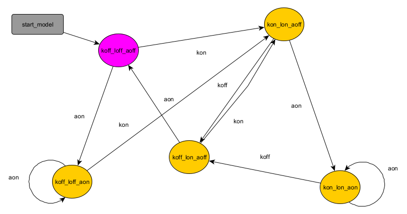

<!-- PROJECT LOGO -->
 

  

  <h1 align="center">Model-Based Testing Tool</h1>

  

    This is the first part of the testing tool. 
     
    <a href="https://github.com/"><strong>for second part »</strong></a>
     
     
    </a>
  

<!-- ABOUT THE PROJECT -->

<h2 align="center">About The Project</h2>

This project aims to test the accuracy of Html-based models created during model-based development processes of systems with the help of test sequences.

The testing process consists of two steps:
* Model transform 
* Testing processes

This part focus on model transform. 

<a href="https://github.com/"><strong> --> Model Transform</strong></a>

<a href="https://github.com/"><strong> --> Testing Processes</strong></a>

## Model Transform

Model transformation is customized for 'yEd Graph Editor' diagrams.

<a href="https://www.yworks.com/"><strong> yEd Graph Editor web page</strong></a>

<a href="https://github.com/yworks"><strong> yEd Graph Editor gitHub page</strong></a>

## Getting Started

After the model diagram of the design is created with the "graph editor", the relevant file is defined in the program.

An example model is given below:

The model.java file, which is created after the program is run, is then used in the testing process.

## License

Distributed under the MIT License. See `LICENSE.txt` for more information.

## Contact

Hasan YİĞİT - [@ygthasan](https://www.linkedin.com/in/ygthasan/) - yigithasan22@gmail.com

Project Link: [https://github.com/ygt22](https://github.com/ygt22)
Project Link: [https://bitbucket.org/ygt22](https://bitbucket.org/ygt22/)

<a href="https://github.com/othneildrew/Best-README-Template"><strong> readMe.md template</strong></a>

